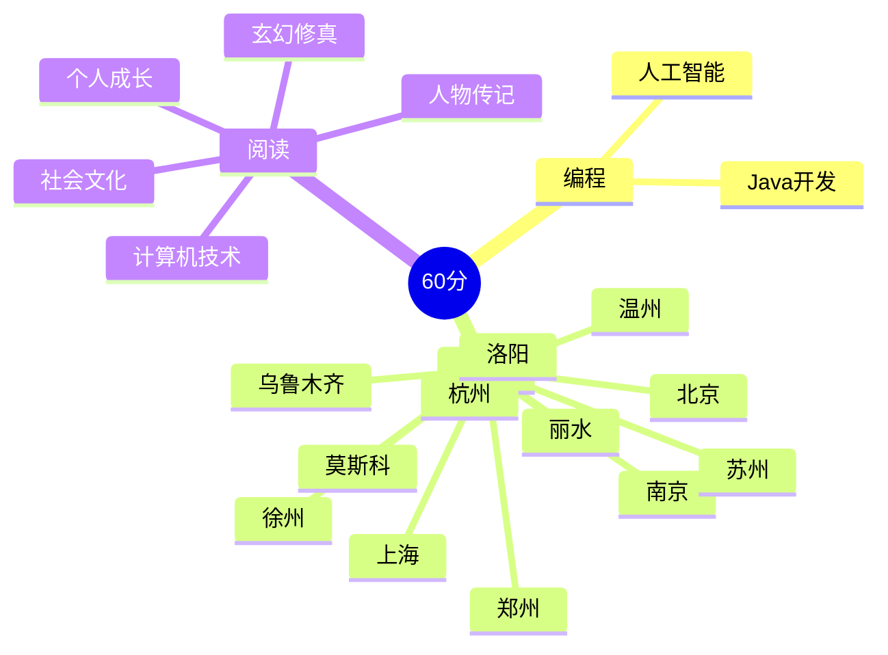

<div align="center">

  <!-- dynamic typing effect 动态打字效果 -->

  <div align="center">
    <a href="https://blog.sunguoqi.com/">
      
    </a>
  </div>

  <!-- knock code pictures 敲代码的图片 -->
  <br>

  <!-- profile logo 个人资料徽标 -->

  <div align="center">
    <!-- visitor statistics logo 访问量统计徽标 -->
    
  </div>

<!-- Snake Code Contribution Map 贪吃蛇代码贡献图 -->

<picture>
  <source media="(prefers-color-scheme: dark)" srcset="https://cdn.jsdelivr.net/gh/aiwandianao/aiwandianao/profile-snake-contrib/github-contribution-grid-snake-dark.svg" />
  <source media="(prefers-color-scheme: light)" srcset="https://cdn.jsdelivr.net/gh/aiwandianao/aiwandianao/profile-snake-contrib/github-contribution-grid-snake.svg" />
  
</picture>

</div>

# 🙋 Hello

<!-- About me 关于我 -->

### 🤺 About Me


<p>&emsp;&emsp;大家好，我是60分。</p>
<p>&emsp;&emsp;热爱编程、跑步、读书、旅行。</p>
<p>&emsp;&emsp;热爱计算机科学和IT互联网事业，励志成为一名优秀的开发者。</p>
<p>&emsp;&emsp;我们正在让这个世界变得更加美好，通过代码的重复使用和延展构建完美体系。</p>
<p><strong>&emsp;&emsp;We're making the world a better place. Through constructing elegant hierarchies for maximum code reuse and extensibility.</strong></p>

</td></tr>


### 🏢 Work Experience


- [南京途牛旅游网](https://www.tuniu.com/) &emsp; 📌 2023-07-11 —— 2023-09-26
  - 工作岗位：软件开发工程师（实习）
  - 工作内容：机票部门


</td>
</tr>


<tr><td>

<!-- wakatime 统计 -->

<tr><td>

<!--START_SECTION:waka-->
**I'm an Early 🐤** 

```text
🌞 Morning                395 commits         ██████░░░░░░░░░░░░░░░░░░░   22.35 % 
🌆 Daytime                548 commits         ████████░░░░░░░░░░░░░░░░░   31.01 % 
🌃 Evening                553 commits         ████████░░░░░░░░░░░░░░░░░   31.30 % 
🌙 Night                  271 commits         ████░░░░░░░░░░░░░░░░░░░░░   15.34 % 
```

📅 **I'm Most Productive on Friday** 

```text
Monday                   228 commits         ███░░░░░░░░░░░░░░░░░░░░░░   12.90 % 
Tuesday                  194 commits         ███░░░░░░░░░░░░░░░░░░░░░░   10.98 % 
Wednesday                227 commits         ███░░░░░░░░░░░░░░░░░░░░░░   12.85 % 
Thursday                 222 commits         ███░░░░░░░░░░░░░░░░░░░░░░   12.56 % 
Friday                   486 commits         ███████░░░░░░░░░░░░░░░░░░   27.50 % 
Saturday                 163 commits         ██░░░░░░░░░░░░░░░░░░░░░░░   09.22 % 
Sunday                   247 commits         ███░░░░░░░░░░░░░░░░░░░░░░   13.98 % 
```

📊 **This Week I Spent My Time On** 

```text
🕑︎ Time Zone: Asia/Shanghai

💬 Programming Languages: 
Markdown                 6 hrs 3 mins        ████████████░░░░░░░░░░░░░   46.31 % 
TypeScript               2 hrs 37 mins       █████░░░░░░░░░░░░░░░░░░░░   20.06 % 
Vue.js                   2 hrs 22 mins       █████░░░░░░░░░░░░░░░░░░░░   18.16 % 
SCSS                     1 hr                ██░░░░░░░░░░░░░░░░░░░░░░░   07.74 % 
JSON                     31 mins             █░░░░░░░░░░░░░░░░░░░░░░░░   03.95 % 

🔥 Editors: 
VS Code                  7 hrs 27 mins       ██████████████░░░░░░░░░░░   56.89 % 
Obsidian                 5 hrs 38 mins       ███████████░░░░░░░░░░░░░░   43.11 % 

💻 Operating System: 
Windows                  11 hrs 7 mins       █████████████████████░░░░   84.97 % 
Mac                      1 hr 58 mins        ████░░░░░░░░░░░░░░░░░░░░░   15.03 % 
```

 Last Updated on 22/10/2023 01:17:37 UTC
<!--END_SECTION:waka-->

</td></tr>
</table>

<!-- ########################################## 分割 ########################################## -->


<div align="center" >



<!-- just img 图片 -->


<!-- programming tool icon 编程工具图标 -->
<br>

<!-- svg -->

 


<br>

<!-- gif -->


</div>

<!-- profile-3d-contrib 3D贡献图-->

</div>

<!-- ########################################## 分割 ########################################## -->


<div align="center" >


<!-- Quotes 名人名言 -->
<br>

<!-- GitHub 奖杯🏆 -->
<br>

<!-- GitHub 数据统计 -->

<br><br>


<!-- Wakatime Graph-->

<table>
  <tr>
    <td></td>
    <td></td>
  </tr>
</table>

</div>

<!-- ########################################## 分割 ########################################## -->


<div align="center">
<!-- run 图片 -->


<!-- GitHub Activity Graph GitHub 活动图 -->

<table align="center">
  <tr>
    <td></td>
  </tr>
</table>

</div>

<!-- just img 图片 -->

</div>