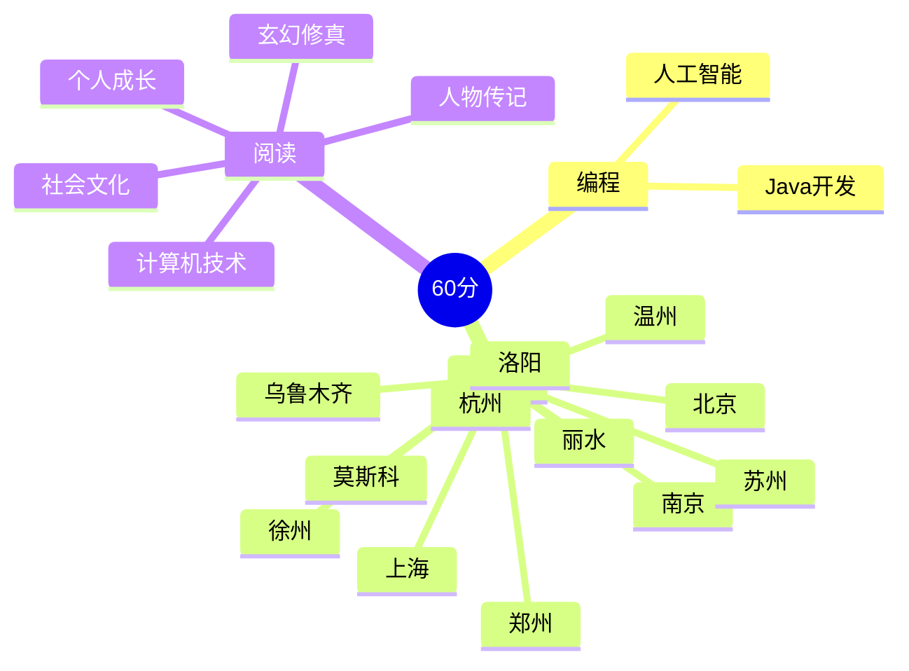

  <!-- dynamic typing effect 动态打字效果 -->

  

    
  

  <!-- knock code pictures 敲代码的图片 -->
   

  <!-- profile logo 个人资料徽标 -->

  

    <!-- visitor statistics logo 访问量统计徽标 -->
    
  

<!-- Snake Code Contribution Map 贪吃蛇代码贡献图 -->

<picture>
  <source media="(prefers-color-scheme: dark)" srcset="https://cdn.jsdelivr.net/gh/aiwandianao/aiwandianao/profile-snake-contrib/github-contribution-grid-snake-dark.svg" />
  <source media="(prefers-color-scheme: light)" srcset="https://cdn.jsdelivr.net/gh/aiwandianao/aiwandianao/profile-snake-contrib/github-contribution-grid-snake.svg" />
  
</picture>

# 🙋 Hello

<!-- About me 关于我 -->

 5+年技术博主，CSDN笔耕不辍、云计算初级工程师…… 
  

 Java开发，也掌握Python相关技术栈  
  

 擅长Java、Lniux、Redis，对操作系统、网络......也有涉猎
  
</td></tr>

### 开源项目  

- [github profile]([aiwandianao/aiwandianao: sun0225SUN's profile with 0 stars and 0 forks 🎉 (github.com)](https://github.com/aiwandianao/aiwandianao))github首页	

[查看更多](https://github.com/xindoo/)	 

</td>
<td valign="top" width="33%">

### 我的博客

[查看更多](https://xindoo.blog.csdn.net/)

</td>
<td valign="top" width="33%">

</table>

<!-- ########################################## 分割 ########################################## -->

<!-- programming tool icon 编程工具图标 -->
 

<!-- GitHub 数据统计 -->

 

<!-- ########################################## 分割 ########################################## -->

