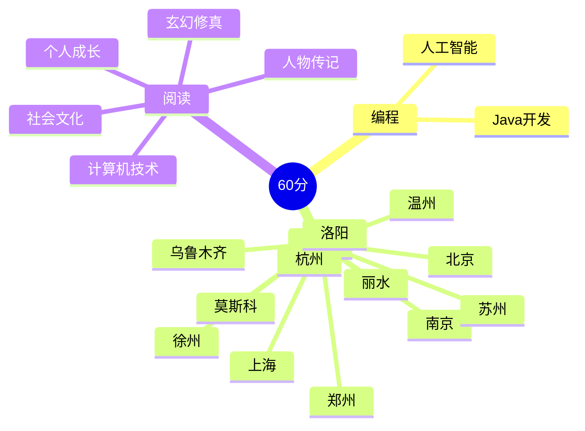

  
   

    
  

	

	   
	

  

    
  

  

	

 5+年技术博主，CSDN笔耕不辍、云计算初级工程师…… 
  

 Java开发，也掌握Python相关技术栈  
  

 擅长Java、Lniux、Redis，对操作系统、网络......也有涉猎
  
<table align="center">
<td valign="top" width="33%">

### 工作经验  

- [途牛旅游网-机票部门](https://www.tuniu.com/) &emsp; 📌 2023-07 —— 2023-09
  - 工作岗位：Java后端工程师（实习）
- [网易-有数](https://research.netease.com/about-us) &emsp; 📌 2023-11 —— 2024-02
  - 工作岗位：Java后端工程师（实习）
</td>

<td valign="top" width="33%">

### 开源项目  
- [my_github_profile](https://github.com/aiwandianao/aiwandianao)我github首页	
  

[查看更多](https://github.com/aiwandianao/)	 

</td>

<td valign="top" width="33%">

### 我的博客
- [【开源】参与开源项目：从修复Typo开始](https://blog.csdn.net/aiwandianao/article/details/139323412)
- [【SOFARPC框架的设计和实现】笔记记录](https://blog.csdn.net/aiwandianao/article/details/139301602)
- [【MyBatis-Plus 源码分析】核心组件、工作流程、SQL执行过程、源码分析](https://blog.csdn.net/aiwandianao/article/details/139298512)
- [基于windows通过kind部署轻量级便携式k8s集群](https://blog.csdn.net/aiwandianao/article/details/139055673)
- [学习kong官方文档](https://blog.csdn.net/aiwandianao/article/details/138998239)

[查看更多](https://blog.csdn.net/aiwandianao?type=blog)
</table>

</td>
<td valign="top" width="33%">

</table>

<!-- programming tool icon 编程工具图标 -->
 

<!-- GitHub 数据统计 -->

 

	