```mermaid
mindmap
  root((60分))
    编程
      Java开发
      人工智能
    旅行
      北京
      莫斯科
      徐州
      南京
      苏州
      乌鲁木齐
      杭州
      上海
      丽水
      温州
      洛阳
      郑州    
    阅读
      计算机技术
      人物传记
      个人成长
      社会文化
      玄幻修真
      
```
  
   

    
  

	

	   
	

  

    
  

  

	

 5+年技术博主，CSDN笔耕不辍、云计算初级工程师…… 
  

 Java开发，也掌握Python相关技术栈  
  

 擅长Javaã€Lniuxã€Redis，对操作系统、网络......也有涉猎
  
<table align="center">
<td valign="top" width="33%">

### 工作经验  

- [途牛旅游网](https://www.tuniu.com/) &emsp; 📌 2023-07 —— 2023-09
  - 工作岗位：软件开发工程师（实习）
- [网易](https://research.netease.com/about-us) &emsp; 📌 2023-11 —— 至今
  - 工作岗位：Java工程师（实习）
</td>

<td valign="top" width="33%">

### 开源项目  
- [my_github_profile](https://github.com/aiwandianao/aiwandianao)我github首页	
  

[查看更多](https://github.com/aiwandianao/)	 

</td>

<td valign="top" width="33%">

### 我的博客
- [运行yudao前后端](https://blog.csdn.net/aiwandianao/article/details/134624807)
- [我组长推荐看的 网关的总结博客](https://blog.csdn.net/aiwandianao/article/details/134600953)
- [了解消息队列的五大痛点](https://blog.csdn.net/aiwandianao/article/details/134574133)
- [【gpts】学算法题[缺失的第一个正数](https://leetcode.cn/problems/first-missing-positive/)](https://blog.csdn.net/aiwandianao/article/details/134537663)
- [【力扣的101夜】轮转数组](https://blog.csdn.net/aiwandianao/article/details/134536959)

[查看更多](https://aiwandianao.blog.csdn.net/)
</table>

</td>
<td valign="top" width="33%">

</table>

<!-- programming tool icon 编程工具图标 -->
 

<!-- GitHub 数据统计 -->

 

	