```mermaid
mindmap
  root((60分))
    编程
      Java开发
      人工智能
    旅行
      北京
      莫斯科
      徐州
      南京
      苏州
      乌鲁木齐
      杭州
      上海
      丽水
      温州
      洛阳
      郑州    
    阅读
      计算机技术
      人物传记
      个人成长
      社会文化
      玄幻修真
      
```

  <!-- dynamic typing effect 动态打字效果 -->

  

    
  

  <!-- knock code pictures 敲代码的图片 -->
   

  <!-- profile logo 个人资料徽标 -->

  

    <!-- visitor statistics logo 访问量统计徽标 -->
    
  

<!-- Snake Code Contribution Map 贪吃蛇代码贡献图 -->

<picture>
  <source media="(prefers-color-scheme: dark)" srcset="https://cdn.jsdelivr.net/gh/aiwandianao/aiwandianao/profile-snake-contrib/github-contribution-grid-snake-dark.svg" />
  <source media="(prefers-color-scheme: light)" srcset="https://cdn.jsdelivr.net/gh/aiwandianao/aiwandianao/profile-snake-contrib/github-contribution-grid-snake.svg" />
  
</picture>

# 🙋 Hello

<!-- About me 关于我 -->

### 🤺 About Me

&emsp;&emsp;大家好。

&emsp;&emsp;热爱编程、跑步、读书、旅行。

&emsp;&emsp;热爱计算机科学和IT互联网事业，励志成为一名优秀的开发者。

&emsp;&emsp;我们正在让这个世界变得更加美好，通过代码的重复使用和延展构建完美体系。

<strong>&emsp;&emsp;We're making the world a better place. Through constructing elegant hierarchies for maximum code reuse and extensibility.</strong>

</td></tr>

### 🏢 Work Experience

- [途牛旅游网](https://www.tuniu.com/) &emsp; 📌 2023-07-11 —— 2023-09-26
  - 工作岗位：软件开发工程师（实习）
  - 工作内容：机票部门

</td>
</tr>

</table>

<!-- ########################################## 分割 ########################################## -->

<!-- programming tool icon 编程工具图标 -->
 

<!-- profile-3d-contrib 3D贡献图-->

<!-- Quotes 名人名言 -->
 

<!-- GitHub 奖杯🏆 -->
 

<!-- GitHub 数据统计 -->

 

<!-- ########################################## 分割 ########################################## -->

<!-- just img 图片 -->

